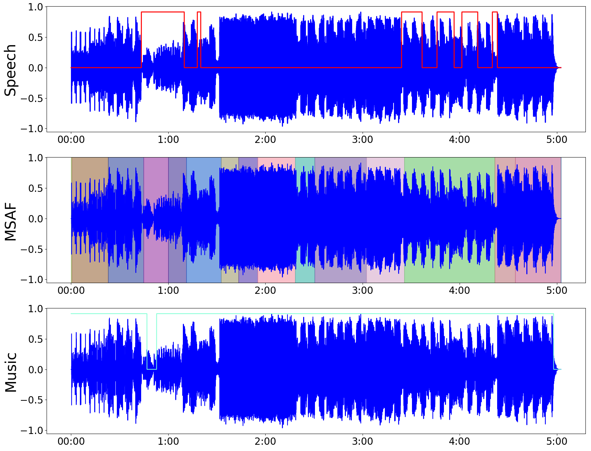

# DJ Tool Retrieval From Personal Music Libraries 
*"Zero-shot [Crate Digging](https://medium.com/cuepoint/the-lost-art-of-cratedigging-4ed652643618) &rarr; DJ Tool retrieval using Speech Activity, Music Structure and CLAP embeddings"*

## What are DJ Tools?
In genres like Hip-Hop, RnB, Reggae/Dancehall and just about every Electronic/Dance/Club 
style, DJ Tools are a selection of audio files curated to heighten the DJ's musical performance
and creative mixing options. These files include &rarr;
- Acapella loops 
- Sound effect samples 
- One-shots vocal samples
- Background-vocal loops
- Drums breaks 
- Melodic hooks
- DJ Drops
- Scratch and Battle loops
- Various drum beats
- Anything else to keep ish fresh! 🚀

Whether mixing live or in the studio, DJ tools facilitate creative mixing options for 
remixes, re-edits, re-drums, mashups, long-playing mixtapes, etc. DJ Tools are commonly sold 
in online shops along with royalty-free sound libraries, samplepacks of loops and beats and 
include key signature, beat and tempo metadata where necessary to ensure sync to the 
DJ project master tempo.

## Crate digging, the Amen Break and a short history of DJ tool
Before the advent of online shops peddling every kind of sonic tool, DJs would sample sections
of riffs from tracks in their vinyl libraries, triggering and looping these samples to elevate
the mix. 

Perhaps one of the most famous examples of this is the Amen break, where the drum break
in a song by the American Funk and Soul band The Winstons called “Amen, Brother”, was sampled
first by Hip-Hop producers as a tool, before it caught fire and became the basis for thousands
of songs. This very technique of sampling drum breaks became the genesis of breakbeat-centric 
genres like Hardcore, Jungle, Drum'n'Bass. The key here is that the DJ knows their music 
library inside-out and can manually excise the juiciest morsels as tools. 

As the amount of recorded music has continued to exponentiate since the first Amen Breaks were 
sampled, today's DJ (including the author) needs to spend a lot of dedicated time listening and 
curating their music library. To get some extra help, I propose this app to identify the 
following classes commonly found in recorded music which also function as DJ Tools. These 
sections may include acappella (vocal) intros, beat-less outros or melodic instrumental passages 
or section breakdowns with just the drum solo. 

## Proposal 
- Use [MSAF](https://github.com/urinieto/msaf) and [SMAD](https://github.com/biboamy/TVSM-dataset) for structural, speech and music segmentation
- Run [CLAP](https://huggingface.co/laion/clap-htsat-unfused) :huggingface: classification on each segment to get a list of classes
  - CLAP classification can be multi-task, taking a list of text descriptors for each 
  DJ Tools class and returning cosine-similarity wrt the audio's segment
  - Output logic to integrate all classification time-series to decide the final output 
  DJ Tools class for each segment, where relevant
  - For example sections of dense mixtures (drums, vocals, instruments) are going to comprise
  the lion's share of audio data. 
  - We expect that DJ Tools (like w/ the Amen Break) will come from {intros, outros, brides, 
  solos, breakdowns, drops} or any other structural segment where a full mix transitions from
  higher to lower density in some interesting way.
- Write out json blob for each Tool segment with `[start_time, stop_time, dj_tool_class]`

## Existing Approaches to Music Classification 
Spotify (formerly Echonest) has a set of properties derived from signal-level analysis of 
songs. This metadata are features in current playlisting algorithms. However they do not by 
themselves, map to any useful tool. Sure acapella will have more speechiness than a full mix,
but it will depend on the mix.

    Genre - the genre of the track
    Year - the release year of the recording. Note that due to vagaries of releases, re-releases, re-issues and general madness, sometimes the release years are not what you'd expect.
    Added - the earliest date you added the track to your collection.
    Beats Per Minute (BPM) - The tempo of the song.
    Energy - The energy of a song - the higher the value, the more energtic. song
    Danceability - The higher the value, the easier it is to dance to this song.
    Loudness (dB) - The higher the value, the louder the song.
    Liveness - The higher the value, the more likely the song is a live recording.
    Valence - The higher the value, the more positive mood for the song.
    Length - The duration of the song.
    Acousticness - The higher the value the more acoustic the song is.
    Speechiness - The higher the value the more spoken word the song contains.
    Popularity - The higher the value the more popular the song is.
    Duration - The length of the song.

# (WIP 🚧) Developer Setup
- `Python 3.12.4`
- Main algorithmic dependency repos must be cloned and installed separately
  - SMAD &rarr; requires `Python 3.10` because the 
  version requirements of {`torch`, `numpy`, etc} are only available on `3.10`
  - MSAF &rarr; requires an older version due to this error [ModuleNotFoundError: No module named 'imp'](https://stackoverflow.com/questions/77274572/multiqc-modulenotfounderror-no-module-named-imp). 
  I tested with `Python 3.11.7`

# ISMIR 2024 Late Breaking Demo feedback & Avenues for future work
- Try averaging the embeddings of each of the short comma-separated "text blobs". This aligns better with the CLAP training captions. We may not need a softmax post-facto then
- Do segmentation in the embedding space. MSAF should allow you to BYO-Segmentation-Algorithm. Are there other better/more-modern segmentation algorithms?
- Use MIRFLEX, we need to have all parts of the system in a singular repos vs the current scattered-across-multiple-repos ting
- Build a proper evaluation dataset
- Are there better embedding systems to use other than CLAP?
